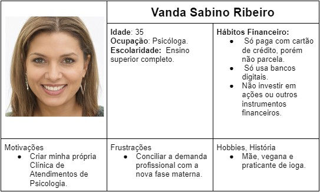
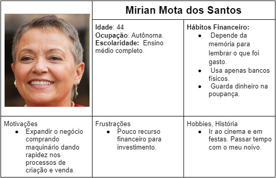
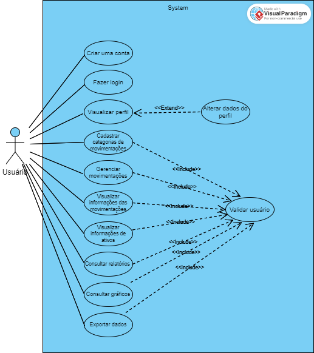

# Especificações do Projeto

Pré-requisitos: <a href="1-Documentação de Contexto.md"> Documentação de Contexto</a>

Os requisitos e as personas apresentadas têm como base entrevistas e experiência pessoal e profissional dos integrantes da equipe, tendo em vista se tratar de uma proposta que visa solucionar o problema de uma categoria com tamanha abrangência não foi necessário simular uma situação, todos os requisitos foram listados como necessidade real do dia a dia desses profissionais. Entretanto as personas são apenas representações gráficas.

## Personas

## Histórias de Usuários

Com base na análise das personas forma identificadas as seguintes histórias de usuários:

|EU COMO... `PERSONA`| QUERO/PRECISO ... `FUNCIONALIDADE` |PARA ... `MOTIVO/VALOR`                 |
|--------------------|------------------------------------|----------------------------------------|
|John Castro Ramos  | Gostaria de receber indicadores de alertas de limites de gastos | Para evitar possíveis gastos excessivos. |
| John Castro Ramos | Gostaria de definir limites de gastos para categorias específicas | Para ter maior controle com gastos em despesas primárias e secundárias. |
| Vanda Sabino Ribeiro | Gostaria de informações do meu fluxo financeiro em forma de gráficos | Para poder ter uma melhor visualização da minha situação financeira |
| Vanda Sabino Ribeiro | Gostaria de cadastrar minhas despesas diárias | Para poder ter mais organização no ato de pagamento de contas. |
| Mirian Mota dos Santos  | Gostaria de ter acesso a relatórios de vendas dos ativos investidos | Para ter controle dos produtos mais solicitados. |
| Mirian Mota dos Santos  | Gostaria de informações dos rendimentos dos ativos ao decorrer do tempo | Para ter controle de investimentos futuros. |

## Requisitos

As tabelas que se seguem apresentam os requisitos funcionais e não funcionais que detalham o escopo do projeto.

### Requisitos Funcionais

|ID    | Descrição do Requisito  | Prioridade |
|------|-----------------------------------------|----|
|RF-01| Cadastro de usuários: permitir que os usuários se cadastrem no sistema, fornecendo informações básicas, como nome, e-mail e senha. | ALTA | 
|RF-02| Login: permitir que os usuários acessem o sistema, digitando seu e-mail e senha | ALTA |
|RF-03| Alterar dados: permitir que os usuários alterem os dados do perfil. | MÉDIA |
|RF-04| Cadastrar categorias de movimentações: permitir que os usuários cadastrem livremente categorias de suas movimentações, como alimentação; transporte; investimento; salário; proventos; etc. | ALTA |
|RF-05| Ferramentas de análise: oferecer ferramentas de análise e acompanhamento da carteira, incluindo gráficos, relatórios e receitas. | MÉDIA |
|RF-06| Visualização de informações de ativos: permitir que os usuários visualizem as informações de ativos pré-definidos pelo sistema (ações e fundos imobiliários), como preço atual, proventos recebidos e saldo. | MÉDIA |
|RF-06| Exportação de dados: permitir que os usuários exportem seus dados para planilhas, facilitando a análise e o compartilhamento de informações. | MÉDIA |

### Requisitos não Funcionais

|ID     | Descrição do Requisito  |Prioridade |
|-------|-------------------------|----|
|RNF-01| Segurança: o sistema deve ser seguro e proteger os dados pessoais e financeiros dos usuários. | ALTA | 
|RNF-02| Confiabilidade: o sistema deve ser confiável e disponível para uso em todo o momento. |  ALTA |
|RNF-03| Usabilidade: o sistema deve ser fácil de usar, intuitivo e com boa navegabilidade | ALTA |
|RNF-04| Escalabilidade: o sistema deve ter capacidade de crescer e se adaptar a diferentes demandas e números de usuários. | MÉDIA |
|RNF-05| Compatibilidade: o sistema deve ser compatível com diferentes dispositivos e navegadores. | ALTA |
|RNF-06| Manutenibilidade: o sistema deve ser fácil de manter e atualizar, com código limpo e documentação clara. | MÉDIA |
|RNF-07| Conformidade: o sistema deve estar em conformidade com as regulamentações financeiras e de privacidade em vigor, como a Lei Geral de Proteção de Dados (LGPD) no Brasil. | ALTA |

## Restrições

O projeto está restrito pelos itens apresentados na tabela a seguir.

|ID| Restrição                                             |
|--|-------------------------------------------------------|
|RE-01| O projeto deverá ser entregue no final do semestre letivo, não podendo extrapolar a data de 19/06/2023. |
|RE-02| O aplicativo deve se restringir às tecnologias básicas da Web no Frontend e Backend, utilizando as linguagens HTML, CSS, JavaScript e C#. |
|RE-03| O projeto conta com a participação de sete integrantes, que dividirão as atividades de desenvolvimento, não podendo subcontratar o trabalho. |
|RE-04| O projeto não poderá gerar custos. |

## Diagrama de Casos de Uso

