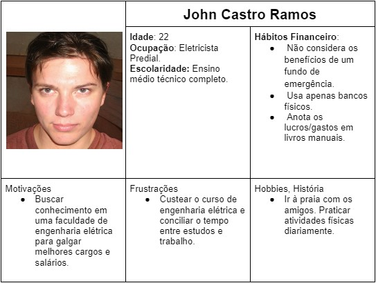

# Especificações do Projeto

Pré-requisitos: <a href="1-Documentação de Contexto.md"> Documentação de Contexto</a>

Os requisitos e as personas apresentadas têm como base entrevistas e experiência pessoal e profissional dos integrantes da equipe, tendo em vista se tratar de uma proposta que visa solucionar o problema de uma categoria com tamanha abrangência não foi necessário simular uma situação, todos os requisitos foram listados como necessidade real do dia a dia desses profissionais. Entretanto as personas são apenas representações gráficas.

## Personas

## Histórias de Usuários

Com base na análise das personas forma identificadas as seguintes histórias de usuários:

|EU COMO... `PERSONA`| QUERO/PRECISO ... `FUNCIONALIDADE` |PARA ... `MOTIVO/VALOR`                 |
|--------------------|------------------------------------|----------------------------------------|
|John Castro Ramos  | Gostaria de receber indicadores de alertas de limites de gastos | Para evitar possíveis gastos excessivos. |
| John Castro Ramos | Gostaria de definir limites de gastos para categorias específicas | Para ter maior controle com gastos em despesas primárias e secundárias. |
| Vanda Sabino Ribeiro | Gostaria de informações do meu fluxo financeiro em forma de gráficos | Para poder ter uma melhor visualização da minha situação financeira |
| Vanda Sabino Ribeiro | Gostaria de cadastrar minhas despesas diárias | Para poder ter mais organização no ato de pagamento de contas. |
| Mirian Mota dos Santos  | Gostaria de ter acesso a relatórios de vendas dos ativos investidos | Para ter controle dos produtos mais solicitados. |
| Mirian Mota dos Santos  | Gostaria de informações dos rendimentos dos ativos ao decorrer do tempo | Para ter controle de investimentos futuros. |

## Requisitos

As tabelas que se seguem apresentam os requisitos funcionais e não funcionais que detalham o escopo do projeto.

### Requisitos Funcionais

|ID    | Descrição do Requisito  | Prioridade |
|------|-----------------------------------------|----|
|RF-01| O sistema deve permitir ao usuário a possível realização de login ou cadastro e validar a entrada de dados. | ALTA | 
|RF-02| O sistema deve permitir ao usuário a recuperação de senha e validar a entrada de dados. | ALTA |
|RF-03| O sistema deve permitir ao usuário cadastrar livremente categorias de suas movimentações, como alimentação, transporte e etc. | ALTA |
|RF-04| O sistema deve permitir ao usuário inserir e editar itens cadastrados organizados por categorias. | ALTA |
|RF-05| O sistema deve permitir ao usuário fazer as análises dos orçamentos e acompanhamento da carteira, através de gráficos, relatórios e receitas | MÉDIA |
|RF-06| O sistema deve permitir ao usuário visualizar as informações de ativos pré-definidos pelo sistema de ações e fundos imobiliários, como preço atual, proventos recebidos e saldo. | MÉDIA |

### Requisitos não Funcionais

|ID     | Descrição do Requisito  |Prioridade |
|-------|-------------------------|----|
|RNF-01| O site deve fornecer segurança de dados (LGPD). | ALTA | 
|RNF-02| O site deve ser responsivo permitindo a visualização em um celular de forma adequada. |  ALTA |
|RNF-03| O site deve poder ser utilizado sem treinamento prévio, fácil de usar, intuitivo e com boa navegabilidade. | ALTA |
|RNF-04| O site deve ter uma boa performance, sendo rápido e eficiente. | MÉDIA |
|RNF-05| O site deve ter bom nível de contraste entre os elementos da tela em conformidade. | ALTA |
|RNF-06| O site deve ser transparente em relação às políticas de privacidade, termos de serviço e quem somos. | MÉDIA |
|RNF-07| O site deve ter capacidade de crescer e se adaptar a diferentes demandas e números de usuários. | MÉDIA |

## Restrições

O projeto está restrito pelos itens apresentados na tabela a seguir.

|ID| Restrição                                             |
|--|-------------------------------------------------------|
|RE-01| O projeto deverá ser entregue no final do semestre letivo, não podendo extrapolar a data de 19/06/2023. |
|RE-02| O aplicativo deve se restringir às tecnologias básicas da Web no Frontend e Backend, utilizando as linguagens HTML, CSS, JavaScript e C#. |
|RE-03| O projeto conta com a participação de sete integrantes, que dividirão as atividades de desenvolvimento, não podendo subcontratar o trabalho. |
|RE-04| O projeto não poderá gerar custos. |

## Diagrama de Casos de Uso

<<<<<<< HEAD

=======
>>>>>>> 886e980a5449f7be243cc4aaa7d2744149f4e096
