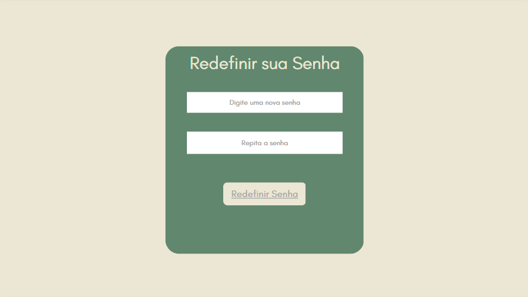
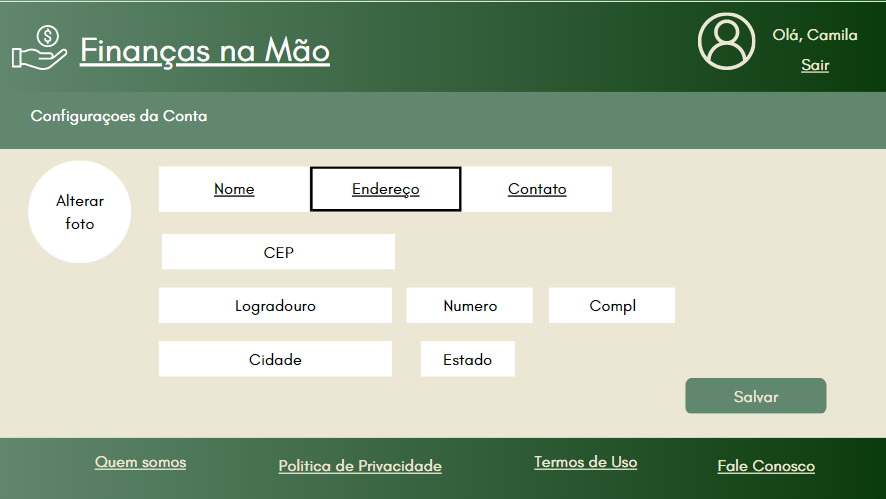
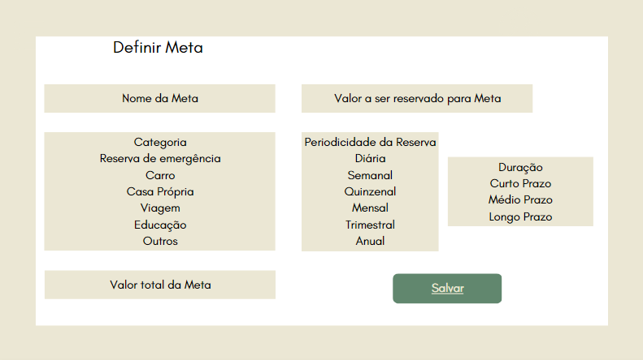
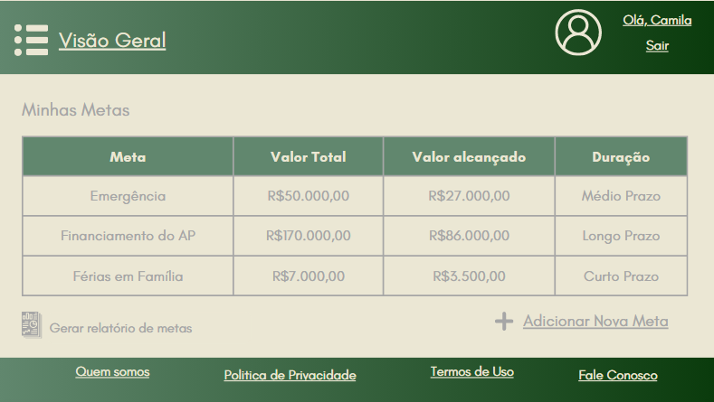
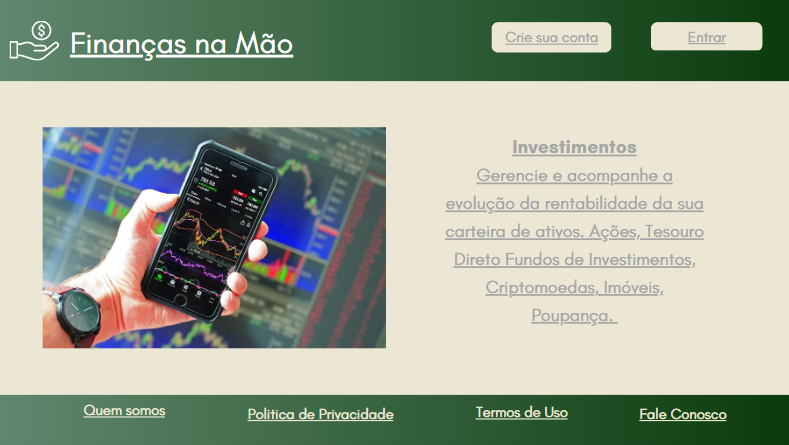
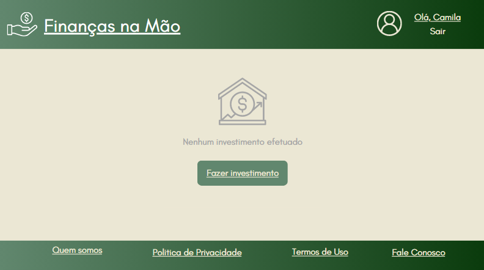

# Projeto de Interface

Pré-requisitos: <a href="2-Especificação do Projeto.md"> Documentação de Especificação</a>

Dentre as preocupações para a montagem da interface do sistema, estamos estabelecendo foco em questões como agilidade, acessibilidade e usabilidade. Desta forma, o projeto tem uma identidade visual padronizada em todas as telas que são projetadas para funcionamento em desktops e dispositivos móveis.

## Diagrama de Fluxo

O diagrama apresentado na Figura 2 é uma representação visual clara e concisa do fluxo de interação do usuário por meio das diversas telas do sistema. Para obter uma compreensão mais detalhada das especificidades de cada tela, a seção de Wireframes que segue após a apresentação do diagrama pode ser consultada. Com o intuito de proporcionar uma melhor análise do diagrama de fluxo, acesse o  [Finanças na Mão - Diagrama de Fluxo](https://www.figma.com/file/F64QzR1J8mefIq1JEvganj/Finan%C3%A7as-na-M%C3%A3o---Diagrama-de-Fluxo-02?node-id=0%3A1&t=G60y3c59i4Dg3GCp-1).

## Wireframes

Conforme fluxo de telas do projeto, apresentado no item anterior, as telas do sistema são apresentadas em detalhes nos itens que se seguem. Para visualizar o wireframe interativo, acesse o ambiente Canva do projeto.

As telas do sistema apresentam uma estrutura comum que é apresentada na Figura abaixo. Nesta estrutura, existem 3 grandes blocos, descritos a seguir. São eles:
- Cabeçalho - local onde são dispostos elementos fixos de identidade (logo) e navegação principal do site (menu da aplicação);
- Conteúdo - apresenta o conteúdo da tela em questão;
- Barra lateral - apresenta os elementos de navegação secundária, geralmente associados aos elementos do bloco de conteúdo.
- Rodapé - apresenta informações relevantes da aplicação como Quem Somos, Política de Privacidade, Termo de Uso e Fale Conosco.

### Tela Inicial

Essa tela é a primeira a ser apresentada ao usuário. Ela possui uma série de serviços disponíveis pelo site que são visualizados por transição e onde o Usuário pode clicar para acessar aquela determinada opção. Contém também botões para que o usuário consiga efetuar o login e/ou cadastro, além das opções do rodapé de conhecer um pouco mais dos desenvolvedores da plataforma, falar conosco e etc.

### Tela - Crie sua Conta

No cabeçalho da página Inicial o usuário terá a opção de efetuar o Cadastro para começar a utilizar os serviços disponibilizados pela aplicação. Ao clicar no botão “Crie sua Conta” abre-se uma janela do tipo Modal para que ele adicione suas informações.

### Tela - Login

Também na Tela Inicial, o Usuário que já tiver cadastro, tem a opção de efetuar o Login. Ao clicar no botão “Entrar” uma janela do tipo Modal se abre para que ele insira seu e-mail e sua senha acessando assim, suas informações.

### Tela - Redefinir sua Senha

Caso o Usuário não se recorde da senha utilizada para o acesso ao site ele poderá clicar na opção “Esqueci minha Senha”. Ao clicar nessa opção, uma janela se abrirá no qual ele deverá digitar o seu e-mail cadastrado. Para esse e-mail, será enviado  um link para que o Usuário efetue a troca de sua senha. Ao clicar no link, ele será redirecionado para a página na qual deverá efetuar a troca.

### Tela - Usuário Logado

Após fazer o cadastro/login no site o Usuário é redirecionado a Tela Inicial onde agora ela é personalizada no canto superior direito com seu Nome e a opção de sair. Ao clicar no seu Nome o usuário será redirecionado ao seu Perfil, podendo efetuar alterações, adicionar e excluir dados pessoais.

### Tela - Configurações de Conta

Ao clicar no seu Nome ou no ícone, o usuário será redirecionado ao seu Perfil, podendo efetuar alterações, adicionar e excluir dados pessoais de acordo com as abas divididas por categorias. Ao clicar em “Salvar”, essas informações ficarão gravadas da sua Conta.

### Tela - Quem Somos

Ao clicar na opção Quem Somos no rodapé da página uma nova janela será aberta e o Usuário poderá conhecer um pouco mais da história de como foi desenvolvido a aplicação.

### Tela - Política de Privacidade

Na tela de Política de Privacidade o Usuário poderá ter acesso a todas as informações referente a privacidade de seus dados.

### Tela - Termos e Condições de Uso

Na tela de Termos e Condições de Uso o Usuário terá acesso às regras para o uso dos serviços e produtos do site.

### Tela - Fale Conosco

Na tela de Fale Conosco o Usuário terá a opção de mandar uma mensagem aos desenvolvedores da plataforma. Nessa opção possui também os dados e endereço da empresa.

### Tela - Barra lateral de Menu

Durante todo o contato do Usuário com a plataforma, desejando acessar outras áreas da mesma, ele poderá contar com a opção de Menu no canto esquerdo da tela. Esse Menu é visualizado ao clicar no ícone do canto superior esquerdo, podendo levar o Usuário até outra página sem a necessidade de voltar à Página Inicial.

### Tela - Controle de Despesas

Na tela de Controle de Despesas (Transição da Tela Inicial) o Usuário terá a opção de visualizar as suas movimentações. No primeiro acesso, como não possui nenhuma despesa cadastrada, ele deverá clicar no botão “Incluir Despesa” ou no botão “Incluir Cartão de Crédito”.

### Tela - Nova Despesa

Ao clicar no botão “Incluir Despesa” uma janela será aberta na qual o usuário poderá colocar as informações pertinentes a despesa que deseja incluir de acordo com as categorias pré definidas ou, caso ele ache necessário, a uma categoria nova adicionada por ele próprio a lista. Após preencher todas as informações ele deverá clicar no botão “Adicionar Despesa”, onde a despesa cadastrada será mostrada na Tela de movimentações como será visto posteriormente.

### Tela - Minhas Movimentações (após inclusão de dados)

Após adicionar suas despesas e/ou cartões de crédito o Usuário poderá visualizar todas essas informações na página principal da opção Minhas Movimentações. Além disso, ele poderá emitir um relatório com seus dados a ser salvo por ele no formato desejado. Na mesma tela, ao rolar a página, o Usuário terá uma visão gráfica de suas despesas, facilitando a visualização e o entendimento de seus débitos.

### Tela - Acompanhe suas Metas

Na tela Acompanhe suas metas (Transição da Tela Inicial) o Usuário terá a opção de cadastrar e visualizar suas metas cadastradas, gerando assim um controle de projetos futuros. No primeiro acesso, como não possui nenhuma meta cadastrada, ele deverá clicar no botão “Definir Meta”.

### Tela - Definir Meta

Ao clicar no botão “Definir Meta” uma janela será aberta na qual o usuário poderá colocar as informações pertinentes a meta que deseja incluir de acordo com as categorias pré definidas. Além disso, ele poderá também acrescentar outras informações como nome, periodicidade, valor e etc. Após preencher todas as informações ele deverá clicar no botão “Salvar”, onde a meta cadastrada será mostrada na Tela de metas como será visto posteriormente.

### Tela - Minhas Metas (após inclusão de dados)

Após adicionar suas metas o Usuário poderá visualizar todas essas informações na página principal da opção Minhas Metas. Além disso, ele poderá emitir um relatório com seus dados a ser salvo por ele no formato desejado. 

### Tela - Administre seu dinheiro

Na tela Administre seu dinheiro  (Transição da Tela Inicial) o Usuário terá a opção de cadastrar e proventos e visualizar seu saldo em Contas Corrente e Poupança, gerando assim um controle de todos os valores que entram de quando isso ocorre, além de controlar quanto tem disponível em sua conta. No primeiro acesso, como não possui nenhum provento cadastrado, ele deverá clicar no botão “Adicionar Provento”.

### Tela - Adicionar Provento

Ao clicar no botão “Adicionar Provento” uma janela será aberta na qual o usuário poderá colocar as informações pertinentes ao provento  que deseja incluir. Além disso, ele poderá também acrescentar outras informações como data de recebimento e periodicidade no recebimento. Após preencher todas as informações ele deverá clicar no botão “Salvar”, onde o provento cadastrado será mostrado na Tela de Meus Proventos como será visto posteriormente. 

### Tela - Meus Proventos (após inclusão de dados)

Após adicionar seus proventos o Usuário poderá visualizar todas essas informações na página principal da opção Meus Proventos. Além disso, ele poderá emitir um relatório com seus dados a ser salvo por ele no formato desejado.

### Tela - Investimentos

Na tela Investimentos (Transição da Tela Inicial) o Usuário terá a opção de efetuar seus investimentos de acordo com seu perfil investidor e sua necessidade. No primeiro acesso, como não possui nenhum provento cadastrado, ele deverá clicar no botão “Fazer Investimento”.

### Tela - Fazer Investimento

Ao clicar no botão “Fazer Investimento” uma janela será aberta na qual o usuário poderá definir onde deseja investir. Além disso, ele poderá também acrescentar outras informações como o valor aplicado, a data da aplicação e se deseja investir o mesmo valor em um mesmo período a ser definido por ele. Após preencher todas as informações ele deverá clicar no botão “Salvar”, onde o investimento cadastrado será mostrado na Tela de Meus Investimentos como será visto posteriormente.

### Tela - Resumo da Carteira de Investimento (após inclusão de dados)

Após efetuar seus investimentos o Usuário poderá visualizar todas essas informações na página principal da opção Resumo da Carteira de Investimentos. Nesta tela será apresentado também um gráfico com as altas e baixas dos valores investidos pelo usuário, mostrando quais investimentos sofreram valorização e quais sofreram desvalorização. Além disso, ele poderá emitir um relatório com seus dados a ser salvo por ele no formato desejado. 

